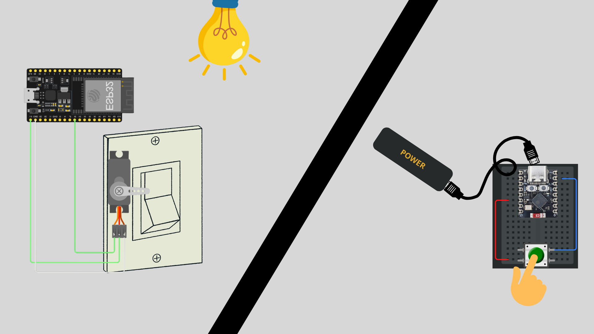
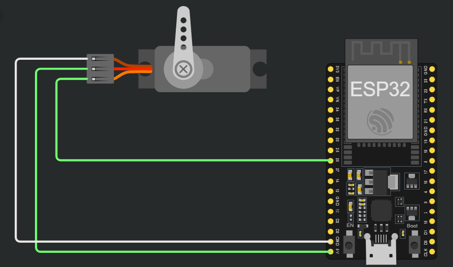
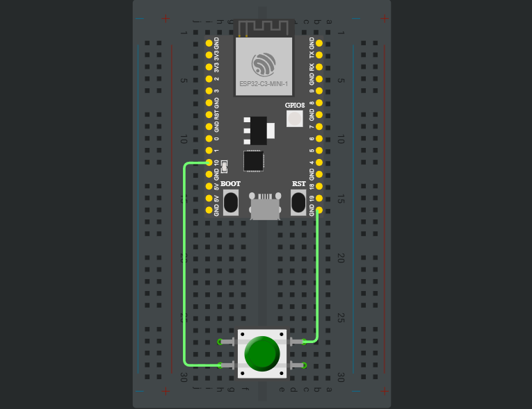

# wireless-light
Um projeto IOT de automação para ligar e desligar um interruptor.

## O que é?
Esse é um projeto desenvolvido para resolver uma situação real. Na minha casa, existe um interruptor que é difícil de ser alcançado, logo, tive a ideia de criar um "botão wireless/sem fio" para ativar ou desativar este interruptor.

## Materiais utilizados
- 1x ESP32
- 2x ESP32 C3 SuperMini
- 3x Protoboards
- 1x ServoMotor
- 2x Botões
- 2x PowerBanks
- 2x Cabos USB-C 
- 1x Cabo Micro-USB
- Alguns jumpers

### Circuitos
- Circuito da placa receptora/main, que está recebendo o estado do botão e acionando o servomotor:

- Circuito do botão que estará enviando o estado do botão:

## Executando o projeto
Em breve

## Desenvolvimento
### Dia 1 (03/02)
Fiz as configurações iniciais do projeto, como instalação dos drivers para o funcionamento do ESP32. Fiz o circuito inicial do "main" e dos botões.\
Main será a placa que estará recebendo as informações dos botões e aciona o interruptor ou não. Os botões serão transmissores de informação e estarão enviando para a placa main. \
A interação será feita atraves do protocolo ESP NOW.

### Dia 2 (04/02)
Pesquisei mais sobre a comunicação via ESP NOW e encontrei um código com as estruturas de enviar e receber dados, então peguei e alterei para se encaixar no meu projeto. Aparentemente, a lógica e a sintaxe parecem certas, mas na prática não funcionou, apesar de testes iniciais que fiz e que deram certo. Ainda não sei se é algum erro de hardware (como mal contato ou energia recebida) ou de software (no código ou no envio do código), mas vou pesquisar mais e descobrir.

## Links úteis
[Arquivo de links úteis](links-uteis.txt)
### Ajuda
- Caso o ESP32 mini ficar desconectando e conectando no pc, é só apertar e segurar por 3 segundos ambos os botões e soltar de forma simultanea.
- Caso dê muitos erros que não se sabem muito bem (error 1), pode ser a memória do computador que está cheia.

